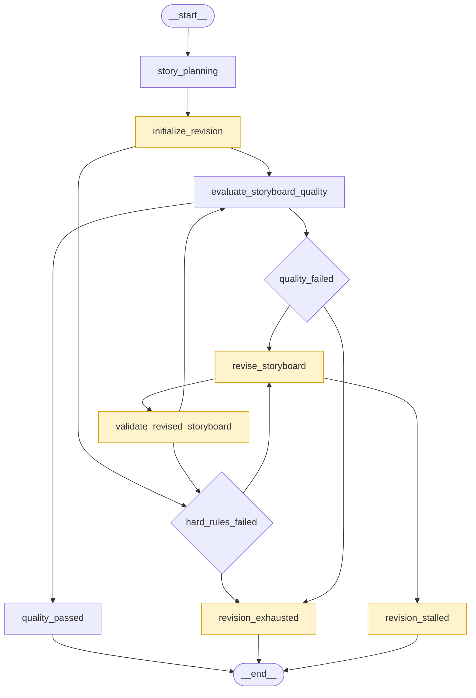

# 工作流

本次功能迭代所对应的工作流（mermaid图）

```mermaid
flowchart TD
    START([__start__])
    END([__end__])
    SP[story_planning]
    IR[initialize_revision]

    HRF{hard_rules_failed}
    VRS[validate_revised_storyboard]

    ESQ[evaluate_storyboard_quality]
    QF{quality_failed}

    RS[revise_storyboard]

    QP[quality_passed]
    RE[revision_exhausted]
    RST[revision_stalled]

    %% 主流程
    START --> SP
    SP --> IR

    %% 初始化后
    IR --> ESQ
    IR --> HRF

    %% 硬规则失败
    HRF --> RS
    HRF --> RE

    %% 修订
    RS --> VRS
    RS --> RST

    %% 修订后的硬规则校验
    VRS --> ESQ
    VRS --> HRF

    %% AI 质量评估
    ESQ --> QP
    ESQ --> QF

    %% AI 质量检查失败
    QF --> RS
    QF --> RE

    %% 结束
    QP --> END
    RE --> END
    RST --> END

    classDef newNode fill:#fff3cd,stroke:#d39e00,color:#333;
    class IR,RS,VRS,RE,RST newNode;
```

